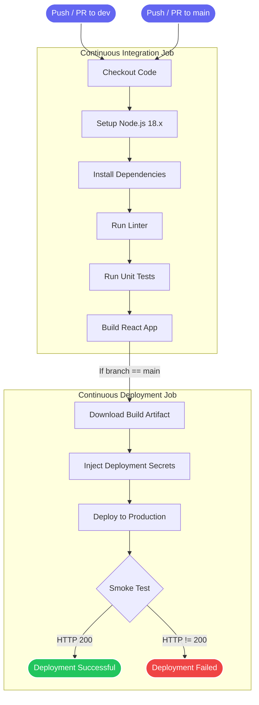

# CI/CD Pipeline Diagram

## Overview
This document outlines the Continuous Integration and Continuous Deployment (CI/CD) pipeline for **Flashcard Master**. The pipeline automates testing, building, and deploying the application to production while running a post-deployment smoke test to ensure system stability.

## Pipeline Flow
